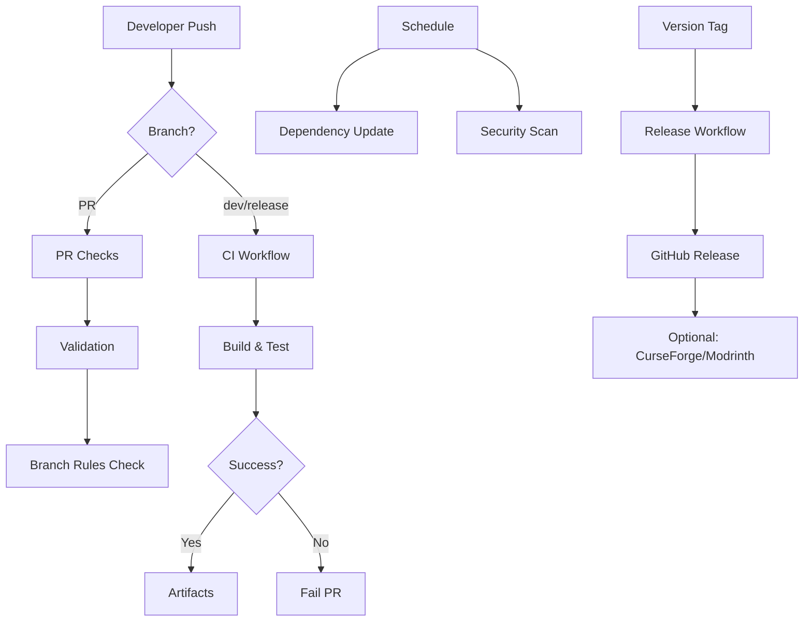
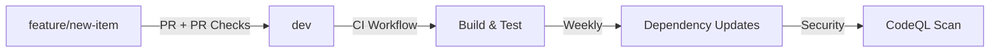
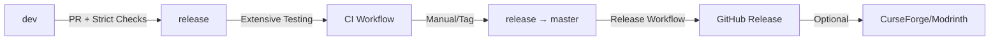

# GitHub Actions Documentation

This document explains the GitHub Actions workflows configured for the HKB Minecraft mod project. These workflows automate building, testing, security scanning, and release management while enforcing our GitFlow branching strategy.

## Table of Contents
- [Overview](#overview)
- [Workflow Files](#workflow-files)
- [Branch Integration](#branch-integration)
- [Setup and Configuration](#setup-and-configuration)
- [Security and Permissions](#security-and-permissions)
- [Troubleshooting](#troubleshooting)

## Overview

Our CI/CD pipeline consists of 5 main workflows that work together to ensure code quality, security, and automated releases:



## Workflow Files

### 1. CI Workflow (`.github/workflows/ci.yml`)

**Purpose**: Continuous Integration for dev and release branches
**Triggers**:
- Push to `dev` or `release` branches
- Pull requests to any branch

#### What it does:
```yaml
Jobs:
  - build:
    - Sets up Java 21 environment
    - Caches Gradle dependencies
    - Runs clean build
    - Executes data generation
    - Validates generated files are up-to-date
    - Uploads build artifacts on success
    - Uploads logs on failure
```

#### Key Features:
- **Gradle Caching**: Speeds up builds by caching dependencies
- **Data Generation Validation**: Ensures `src/generated/resources/` is current
- **Artifact Management**: Stores successful builds for 30 days
- **Multi-Java Support**: Currently Java 21, easily expandable

#### Environment Variables:
```bash
JAVA_VERSION: 21
GRADLE_VERSION: 8.12.1 (compatible with Forge Gradle plugin)
CACHE_KEY: Based on Gradle files hash
ARTIFACT_RETENTION: 30 days
LOG_RETENTION: 7 days (failures only)
```

---

### 2. Release Workflow (`.github/workflows/release.yml`)

**Purpose**: Automated release creation and distribution
**Triggers**:
- Git tags matching `v*.*.*` (e.g., `v1.2.0`)
- Manual workflow dispatch with version input

#### What it does:
```yaml
Jobs:
  - release:
    - Validates trigger is from master branch
    - Sets up build environment
    - Updates version in gradle.properties
    - Builds release JAR
    - Generates changelog from git commits
    - Creates GitHub release
    - Uploads JAR to release assets
    - (Optional) Uploads to CurseForge/Modrinth
```

#### Changelog Generation:
The workflow automatically generates changelogs by:
1. Finding commits since last tag
2. Formatting them as bullet points
3. Adding installation instructions
4. Including compatibility information

#### Example Generated Changelog:
```markdown
## Changes in v1.2.0

- feat(items): add lightning wand with electrical strike mechanics
- fix(datagen): resolve duplicate model provider registration issue
- docs: update coding conventions for git workflow

## Installation
1. Download the JAR file from the assets below
2. Place it in your Minecraft mods folder
3. Requires Minecraft 1.21.7 and Forge 57.0.2+

## Compatibility
- Minecraft: 1.21.7
- Forge: 57.0.2+
- Java: 21+
```

#### CurseForge/Modrinth Integration:
Currently commented out, but ready to enable:
```yaml
# Uncomment and configure with your tokens
# - name: Upload to CurseForge
#   uses: itsmeow/curseforge-upload@v3
#   with:
#     token: ${{ secrets.CF_API_TOKEN }}
#     project_id: YOUR_PROJECT_ID
```

---

### 3. PR Checks Workflow (`.github/workflows/pr-checks.yml`)

**Purpose**: Validates pull requests and enforces GitFlow rules
**Triggers**: Pull request events (opened, synchronized, reopened)

#### What it does:
```yaml
Jobs:
  - validate-pr:
    - Validates PR title follows conventional commits
    - Checks branch naming conventions
    - Enforces target branch rules

  - build-and-test:
    - Runs full build and test suite
    - Checks data generation consistency
    - Comments on PR with results

  - size-check:
    - Monitors JAR file size
    - Warns if size exceeds thresholds
    - Posts build information to PR
```

#### Branch Validation Rules:
```bash
# Valid branch names
feature/item-growth-accelerator-wand  ✅
fix/recipe-generation-crash          ✅
hotfix/critical-dupe-bug             ✅
docs/github-actions-guide            ✅
random-branch-name                   ❌

# Target branch validation
feature/* → dev     ✅
fix/* → dev         ✅
hotfix/* → master   ✅
dev → release       ✅
release → master    ✅
feature/* → master  ❌ (blocked)
```

#### PR Title Validation:
```bash
# Valid PR titles
feat: Add lightning wand item          ✅
fix: Resolve crash on startup          ✅
docs: Update GitHub Actions guide      ✅
chore: Update dependencies             ✅

# Invalid PR titles
Add new item                          ❌
Fixed bug                             ❌
Update                                ❌
```

#### Generated Files Check:
The workflow prevents PRs with outdated generated files:
1. Runs `./gradlew runData`
2. Checks if any files in `src/generated/` changed
3. Comments on PR if files are outdated
4. Fails the check for master branch PRs (strict)

---

### 4. Dependency Update Workflow (`.github/workflows/dependency-update.yml`)

**Purpose**: Automated dependency monitoring and security auditing
**Triggers**:
- Weekly schedule (Mondays at 9 AM UTC)
- Manual workflow dispatch

#### What it does:
```yaml
Jobs:
  - update-dependencies:
    - Checks current dependency versions
    - Updates Gradle wrapper to latest
    - Creates GitHub issue with update checklist

  - security-audit:
    - Scans dependencies for vulnerabilities
    - Generates dependency report
    - Uploads report as artifact
```

#### Created Issue Format:
```markdown
## 🔄 Dependency Update Check

### Current Versions
- **Forge**: 57.0.2
- **Minecraft**: 1.21.7
- **Mappings**: 2025.07.18-1.21.7

### Action Required
Please manually check for updates to:
1. MinecraftForge: Check [website] for latest version
2. Parchment Mappings: Check [ParchmentMC] for updates
3. Gradle: Check if wrapper was updated

### Testing Checklist
- [ ] Mod builds successfully
- [ ] Data generation works
- [ ] Client launches without errors
- [ ] All existing features work
- [ ] No new console errors
```

---

### 5. Security Analysis Workflow (`.github/workflows/codeql-analysis.yml`)

**Purpose**: Automated security vulnerability scanning
**Triggers**:
- Push to main branches
- Pull requests
- Weekly schedule (Sundays at 6 AM UTC)

#### What it does:
```yaml
Jobs:
  - analyze:
    - Sets up CodeQL security scanner
    - Builds the project for analysis
    - Runs security and quality queries
    - Uploads results to GitHub Security tab
    - Creates artifacts with detailed reports
```

#### Security Queries:
- **Security Extended**: Advanced security vulnerability detection
- **Security and Quality**: Code quality and security issues
- **Custom Queries**: Java-specific vulnerability patterns

---

## Branch Integration

The workflows integrate with our GitFlow branching strategy:

### Development Flow:


### Release Flow:


### Protection Integration:
```yaml
# Branch Protection Rules (configure in GitHub)
master:
  - Requires: 2+ reviewers
  - Requires: All status checks pass
  - Restricts: Only release/* can merge

release:
  - Requires: 1+ reviewer
  - Requires: Build status checks
  - Restricts: Only dev and hotfix/* can merge

dev:
  - Requires: 1 reviewer
  - Requires: Basic build checks
  - Allows: Force push with lease
```

## Setup and Configuration

### Required Secrets:
```yaml
# GitHub (automatically available)
GITHUB_TOKEN: # For releases and API access

# Optional - CurseForge Integration
CF_API_TOKEN: # Your CurseForge API token

# Optional - Modrinth Integration
MODRINTH_TOKEN: # Your Modrinth API token
```

### Repository Settings:
1. **Enable Actions**: Settings → Actions → Allow all actions
2. **Branch Protection**: Settings → Branches → Add rules
3. **Security**: Settings → Security → Enable security advisories

### Environment Setup:
```bash
# Update gradle.properties with your mod details
mod_id=hkbmod
mod_name=HKB Mod
mod_version=1.0.0
mod_authors=YourName

# Update template files
# Replace YOUR_USERNAME with your GitHub username in:
- .github/ISSUE_TEMPLATE/config.yml
```

### Gradle Configuration:
Ensure your `build.gradle` includes:
```gradle
java.toolchain.languageVersion = JavaLanguageVersion.of(21)

// Required for data generation
sourceSets.main.resources { srcDir 'src/generated/resources' }
```

## Security and Permissions

### Workflow Permissions:
```yaml
# CI Workflow
permissions:
  contents: read
  actions: read

# Release Workflow
permissions:
  contents: write    # Create releases
  actions: read

# PR Checks
permissions:
  contents: read
  pull-requests: write  # Comment on PRs
  issues: write        # Create issues

# Security Analysis
permissions:
  security-events: write  # Upload security results
  actions: read
  contents: read
```

### Security Best Practices:
1. **Secrets Management**: Never commit API tokens
2. **Limited Permissions**: Each workflow has minimum required permissions
3. **Dependency Scanning**: Regular security audits
4. **Branch Protection**: Prevents unauthorized changes

### Token Security:
```bash
# GitHub Secrets (Settings → Secrets)
CF_API_TOKEN=xxx        # CurseForge API token
MODRINTH_TOKEN=xxx      # Modrinth API token

# These are encrypted and only available during workflow execution
```

## Troubleshooting

### Common Issues:

#### 1. Build Failures
```bash
# Check logs in Actions tab
Error: Task :compileJava FAILED

# Common solutions:
- Check Java version (should be 21)
- Verify Gradle wrapper permissions
- Clear Gradle cache (re-run workflow)
```

#### 1a. Gradle Version Incompatibility
```bash
# Error message
Error: Found Gradle version Gradle 9.0.0. Versions Gradle 9.0 and newer are not supported yet.

# Solution: Fixed in workflows with explicit Gradle version
- name: Setup Gradle
  uses: gradle/actions/setup-gradle@v4
  with:
    gradle-version: 8.12.1

# Local solution: Update your gradle/wrapper/gradle-wrapper.properties
distributionUrl=https://services.gradle.org/distributions/gradle-8.12.1-bin.zip
```

#### 2. Data Generation Issues
```bash
# Error: Generated files out of date
Solution: Run locally and commit
./gradlew runData
git add src/generated/
git commit -m "chore: update generated files"
```

#### 3. PR Check Failures
```bash
# Branch naming issues
Error: Branch name 'my-feature' doesn't follow convention

Solution: Rename branch
git branch -m feature/my-feature
```

#### 4. Release Workflow Issues
```bash
# Tag not triggering release
Issue: Tag created on wrong branch

Solution: Tags must be on master branch
git checkout master
git tag v1.2.0
git push origin v1.2.0
```

### Debug Tips:

#### Enable Debug Logging:
```yaml
# Add to any workflow for verbose output
- name: Debug Step
  run: echo "Debug info here"
  env:
    ACTIONS_STEP_DEBUG: true
```

#### Test Workflows Locally:
```bash
# Use act to test workflows locally
# Install: https://github.com/nektos/act
act -j build  # Test the build job
```

#### Check Workflow Status:
```bash
# GitHub CLI
gh run list
gh run view <run-id>
gh run logs <run-id>
```

### Performance Optimization:

#### Gradle Caching:
```yaml
# Current cache configuration
- uses: actions/cache@v4
  with:
    path: |
      ~/.gradle/caches
      ~/.gradle/wrapper
    key: ${{ runner.os }}-gradle-${{ hashFiles('**/*.gradle*') }}
```

#### Artifact Management:
```bash
# Retention periods
Build artifacts: 30 days
Failure logs: 7 days
Security reports: 30 days

# Cleanup old artifacts automatically via GitHub settings
```

---

## Workflow Maintenance

### Regular Updates:
1. **Action Versions**: Update action versions quarterly
2. **Dependencies**: Review dependency update issues weekly
3. **Security**: Monitor security alerts continuously
4. **Performance**: Review workflow execution times monthly

### Monitoring:
- **GitHub Actions Tab**: Monitor workflow success rates
- **Security Tab**: Review security findings
- **Insights Tab**: Track repository activity

---
*Created by Claude CLI (Date: 23.09.2025)*

*This documentation should be updated when workflows are modified or new actions are added.*